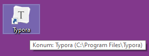
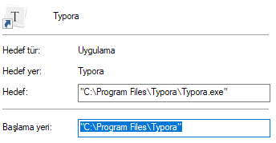
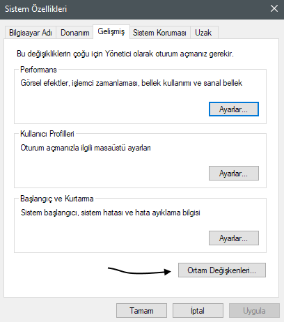
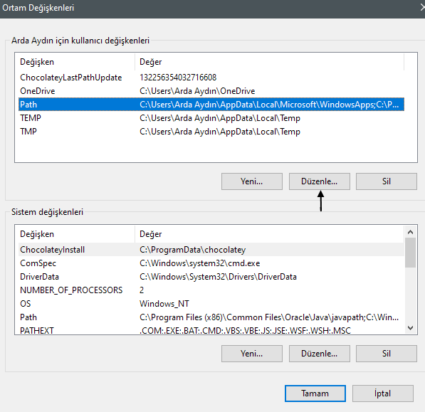

# Adding Typora to PATH

This guide will tell you how to add Typora to your PATH to use this extension. This guide is only for Windows. Other OSes can use the extension without editing/expanding their PATH.

[By the looks of it](https://github.com/cyberbiont/vscode-open-in-typora/pull/5#issuecomment-671279129), Typora can install itself on a different location, so having a set location to search for Typora is hard. That's why we settled on using PATH.

Fortunately, we can still get Typora's path by one of it's shortcuts! Here's how:

Just find a shortcut of it -- even the one from the Start Menu will do it.

<figure>

<figcaption>A Typora shortcut</figcaption>
</figure>

Open it's **Properties**, and copy the "Starting Location" part of it.

<figure>

<figcaption>The location of "Starting Location" bar</figcaption>
</figure>

Open **Control Panel**, go to System & Security, and open **System**.
At the left of the page, click the last link at top rows, **__*Advanced System Settings*__**.

Go to the System tab if it is not there, and click on **Environment Variables**.

<figure>

<figcaption>The System tab of Advanced System Settings.</figcaption>
</figure>

Click on __Path__ variable on either User or System Variables and press **Edit**.

<figure>

<figcaption>Environment Variables window</figcaption>
</figure>

Click on **New** then paste the path we copied, press Enter and click **OK**.

<figure>

<figcaption>Adding an entry step-by-step</figcaption>
</figure>

## Testing the PATH:

Log out and log back in to your account. Open `cmd` and write `typora` and hit enter.
If it works, it will go to the next line while typora opens, if it does not, it will tell it's not recognized. Please re-check the target location.